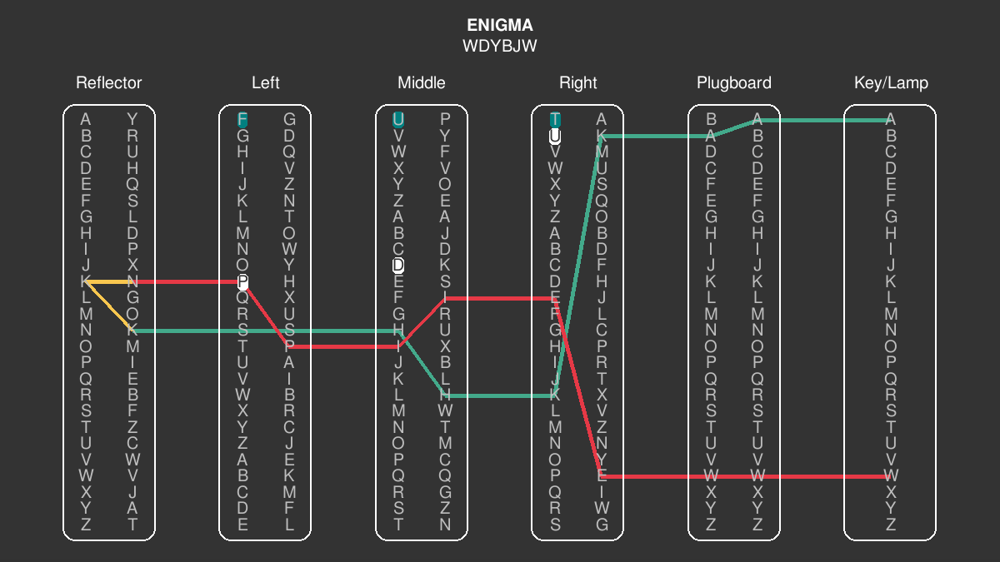

<!-- ABOUT THE PROJECT -->
## About The Project



This project is a Python program that simulates the workings of the Enigma machine, a cipher device used primarily by Nazi Germany during World War II. The Enigma machine allowed for complex enciphering and deciphering of messages using a series of rotors and a plugboard.

<p align="right">(<a href="#readme-top">back to top</a>)</p>

<!-- FEATURES -->
## Features

* Simulation of Enigma machine rotors and plugboard
* Customizable rotor settings and plugboard configurations
* Encoding and decoding of messages

<p align="right">(<a href="#readme-top">back to top</a>)</p>

<!-- INSTALLATION -->
## Installation

To run this program, you'll need Python 3 installed on your machine. You can download Python from [python.org](https://www.python.org/).

1. Clone this repository:
    ```bash
    git clone https://github.com/CyberClaud/enigma-simulator.git
    ```
2. Navigate to the project directory:
    ```bash
    cd enigma-simulator
    ```
3. Install the required dependencies:
    ```bash
    pip install -r requirements.txt
    ```

<p align="right">(<a href="#readme-top">back to top</a>)</p>

<!-- RUN -->
## Run program

Navigate to the project directory (.../enigma-simulator/):
```bash
python3 main.py
```

<p align="right">(<a href="#readme-top">back to top</a>)</p>
